<h1 align="center"> Laboratorio 1 - Ciclos de Vida del Desarrollo del Software </h1>
 

## Colaboradores
- Nicole Dayan Calderón Arévalo
- Andrés Felipe Chavarro Plazas

 

## Descripción del Laboratorio
Laboratorio 1 de la materia de Ciclos de Vida del Desarrollo del Software, en el cual aprendemos y profundizamos en el uso y buen manejo del sistema de control de versiones Git Hub.
En este laboratorio ponemos en practica comandos de git hub para conexión y acciones desde el repositorio local al remoto, tambien entendemos la funcionalidad de estos. A la par de este aprendizaje de la herramienta, empezamos a adquirir conocimientos y habilidades necesarios para el trabajo en equipo en la vida laboral.

 

## :hammer:I. Parte Individual
En esta primera parte del laboratorio, desarrollado individualmente, se busca aprender la creación de repositorios(local y remoto), conectarlos y realizar diferentes acciones con los comandos desde ellos.
Los solicitado a realizar en esta parte es:
1. Crear un repositorio local
2. Agrega un archivo de ejemplo al repositorio, en mi caso el README.md
3. Averiguar para qué sirve y como se usan estos comandos `git add y git commit -m “mensaje”`
4. Abrir una cuenta de github, si ya existe, enlazarla con el correo institucional
5. Crear un repositorio vacío en GitHub
6. Configurar el repositorio local con el repositorio remoto
7. Subir los cambios, teniendo en cuenta el punto 3
8. Configurar el correo en git local

 

## :rocket:Desarrollo
### :desktop_computer:Creación y configuración de repositorios
Para crear el repositorio local el primer paso fue crear una `nueva carpeta 📁` con el nombre que asigne a mi repositorio local

Para efectos practicos el paso siguiente que realice fue crear el repositorio en Git
**_Me apoyo con imagenes de repositorios adicionales que cree para ilustrar el mismo proceso debido a que no fotodocumente la creación de este_**

Al crear el repositorio vacio en Git, se encuentran unas instrucciones para configurarlo con el repositorio local, estas las segui totalmente incluida la creación del read me desde consola. 

Entonces abri la consola de mi equipo y desde alli me dirigi a el repositorio local `Laboratorio1_CVDS`

Seguido de esto aplique todos los comados entregados por Git y mencionados anteriormente

De esta forma desarrolle los punto 1,2,5,6 y 7 en un mismo proceso simple, configurando correctamente los repositorios

### :pencil:Puntos adicionales
- Comandos `git add y git commit -m “mensaje”`

El comando **git add** nos permite subir los cambios realizados en el directorio de trabajo a la staging area, esto nos permite reservar una instantanea del proyecto antes de confirmar totalmente los cambios.
El comando **git commit -m "mensaje"** se utiliza para guardar los cambios en el respositorio y con `-m` podemos adicionar un mensaje sobre dicho commit.

- Enlazar mi cuenta de la universidad

- Configurar el correo desde local

Finalmente habre desarrollado completamente la primera parte del laboratorio adquiriendo nuevos aprendizajes sobre manejo de repositorios en GitHub.

 

## II. Generación y resolución de conflictos
### 📨 Preparativos
Inicialmente, tenemos que definir los roles en el equipo, en este caso:
- Owner: Nicole
- Collaborator: Andrés

Ahora, es necesario que el owner le mande la invitacion al colaborador siguiendo la guia proporcionada. Despues de hacer todo el proceso de agregar un nuevo colaborador al repositorio correctamente, continuamos con la creación y solución de los conflictos.

### :collision: Conflicto inicial
Como se nos sugirio en el documento del laboratorio, los dos intentamos hacer `push` de nuestros cambios al mismo tiempo. Al aplicar el comando los cambios de Andrés fueron aceptados pero, en el caso de Nicole se genero el conflicto.
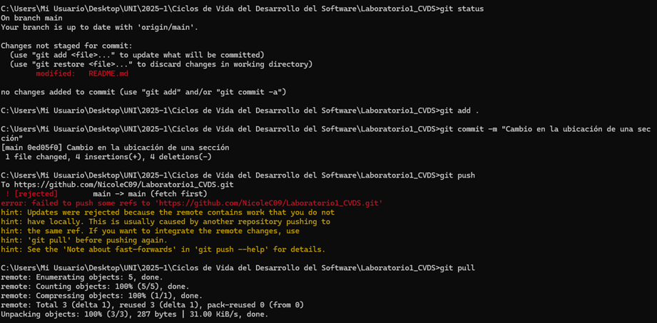

A partir de aquí se busco resolver el conflicto de dos formas diferentes:

- En la primera parte se intento:
    `git pull`
    `git fetch`
    `git push`
    `git merge`
Sin embargo, esto no dio resultado debido a que git fetch sinconizaba los datos pero no los mezclaba y git pull generaba más conflictos por los cambios realizados al mismo archivo.
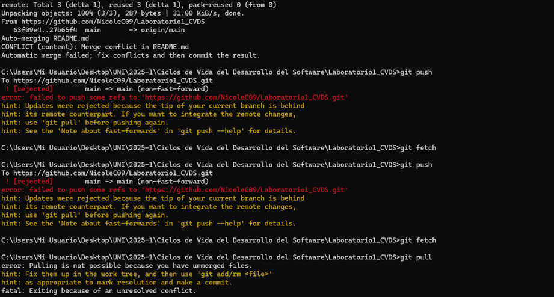

- En la segunda parte si se logro resolver el conflicto, aqui se creo una rama a partir de main para el cambio y luego se mezclo nuevamente.
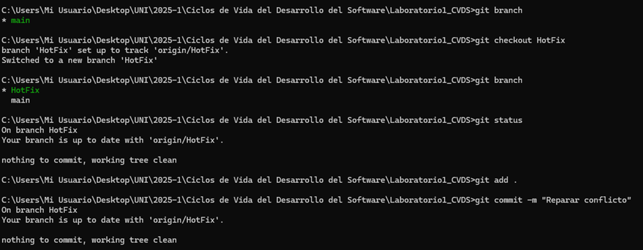

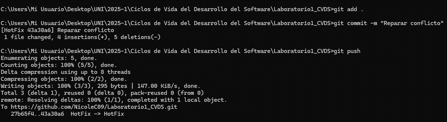

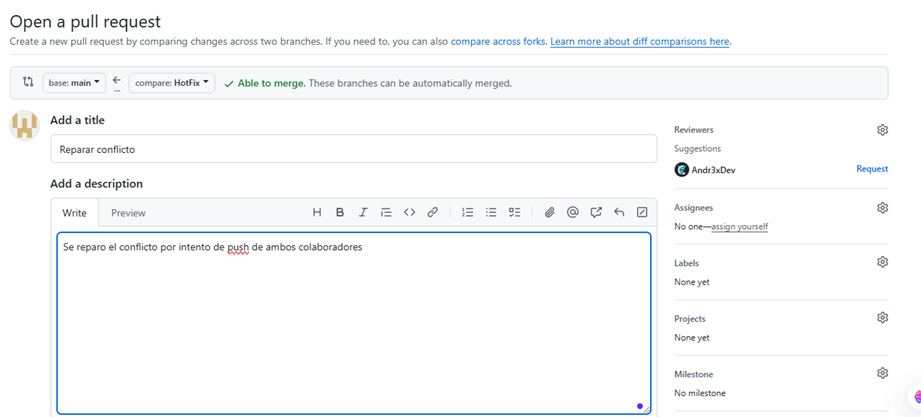

Así damos solución al conflicto y entendemos más acerca de las ramas par realizar cambios en GitHub

 

### Conflicto con IDE's
Al realizar el mismo procedimiento para generar un conflicto, volvemos a la misma situación presentada en la anterior parte. Sin embargo, ahora se nos pide solucionar haciendo uso de algún editor o IDE que nos brinde una herramienta para resolver el problema. En este caso, usamos IntellIJ con su funcionalidad de Git integrada.

  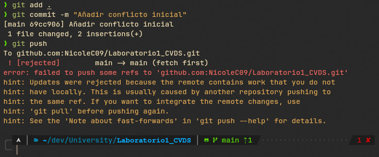

Cuando el conflicto se genera, nos dirigimos al IDE en la parte de Git. En esta, nos detecta que previamente ya está el commit realizado, por lo que únicamente tenemos que subirlo al repositorio remoto. No obstante, al intentarlo nos abre una pestaña de confirmación donde al mismo tiempo se rechaza el push por el conflicto generado, dándonos opciones para solucionarlo según lo que nos sea conveniente, dichas opciones son hacer rebase para sobreponer los cambios del commit en contra del repositorio, o la otra opción que de hecho elegimos, hacer un merge entre las dos versiones del documento con el fin de generar otra versión con los elementos que queremos que se mantengan.

  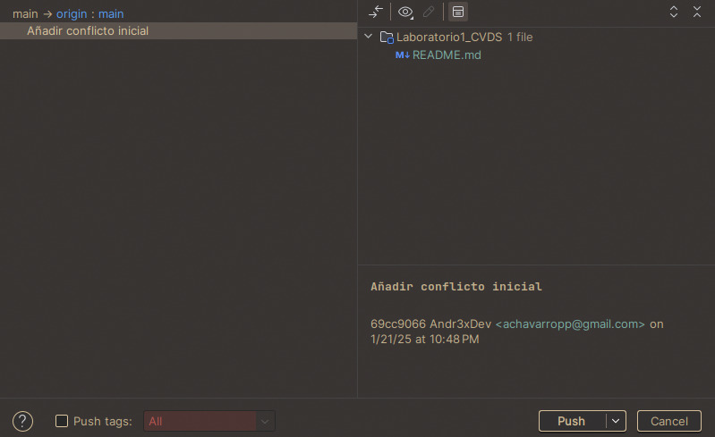

  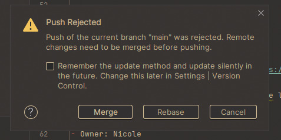

Acto seguido, aparece la pantalla que  nos da la opción del merge manual y se abre otra ventana especial. En esta, hay tres columnas con distintas versiones del archivo, en la derecha la versión que se encuentra en el repositorio, a la izquierda la versión que genero el conflicto y en el centro la versión que quedaría al seleccionar las líneas de código que queremos mantener. 

  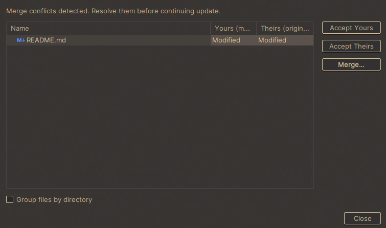

  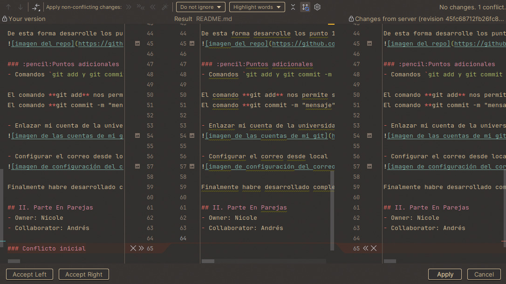

De este modo, pudimos solucionar el conflicto de haciendo posible el push al repositorio.

  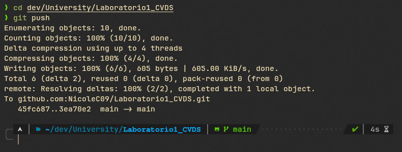

 

## III. Manejo de ramas

### Optimización del Trabajo para Minimizar Conflictos
Usar ramas en Git es esencial para minimizar conflictos porque permite aislar cambios relacionados con una funcionalidad o tarea específica. Esto evita que varios desarrolladores trabajen directamente en la misma rama principal, reduciendo la posibilidad de sobrescribir cambios. Además, las ramas facilitan pruebas y revisiones antes de fusionar al proyecto principal, asegurando que cada cambio esté completamente integrado y funcional sin afectar el trabajo de otros.

 

### ¿Qué es y como funciona el Pull Request?
Un **Pull Request** (tambien conocido como PR) es fundamental en el desarrollo colaborativo porque actúa como un punto de control antes de fusionar cambios de una rama a otra, permitiendo que otros miembros del equipo revisen el código, detecten errores, sugieran mejoras y aseguren que los cambios cumplen con los estándares del proyecto. El proceso para realizar una es el siguiente:
1. Un desarrollador crea una rama para trabajar en una funcionalidad o corrección específica.
2. Realiza los cambios en esa rama y los confirma (commits).
3. Cuando los cambios están listos, abre un Pull Request desde la rama con los cambios hacia la rama de destino.
4. Otros colaboradores revisan el código, comentan o sugieren mejoras.
5. Si todo está correcto, el PR se aprueba y los cambios se fusionan (merge) en la rama objetivo.

De este modo, podemos asegurar que los cambios realizados no generarían un conflicto y permite que el trabajo del equipo de desarrollo se integre de forma correcta.

 

### Creacion de ramas
GitHub nos da la opción de crear ramas desde el mismo repositorio remoto, en este creamos una rama para cada integrante donde cada quien trabajará en los cambios asignados. En este caso, cada uno subirá el desarrollo de la resolución de uno de los dos conflictos. 

  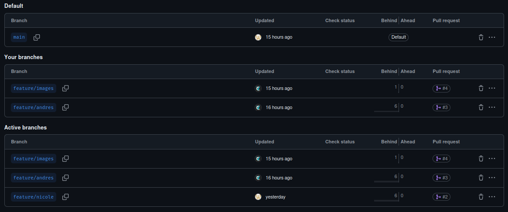

Para llevar a cabo cada procedimiento, en nuestro local actualizamos las ramas existentes con `git fetch` y luego nos pasamos a nuestra respectiva rama con `git checkout` seguido de un `git pull` para asegurar que el contenido de la rama sea correcto y no genere conflictos. Una vez realizados los cambios, se realiza el commit y se sube a su respectiva rama.

 

### PR de cada desarrollador
En el momento en que las ramas están listas para ser integradas al documento en la main, seguimos los pasos de la guía proporcionada para realizar una PR. Así, nos dirigimos a la sección correspondiente y creamos la PR respectiva para cada rama.

  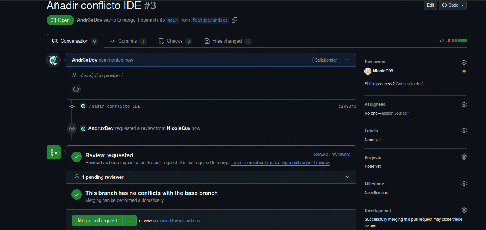

Como podemos apreciar, en la PR mostrada nos da un aviso de que no hay conflictos y es posible realizar un merge a la rama principal teniendo en cuenta que es la segunda que se integró al documento. Por lo cual podemos confirmar que, siempre y cuando no se sobreescribe ni una sola línea de código, es posible trabajar sobre un mismo archivo mediante la ramificación. Para comprobarlo, visualmente se ve de la siguiente manera.

  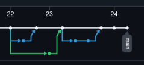

Por otro lado, eliminamos las ramas que ya fueron implementadas a la principal. Pues, por medio de la misma sección donde se crean, pudimos realizar esta opción al presionar las acciones que se pueden realizar con las ramas. De igual manera, cuando el merge se aprueba, nos da la opción de eliminar la rama en ese mismo instante para que el proceso sea más sencillo. En nuestro caso, realizamos una por cada método.

 

### Revision de PR's
Como se nos indicó, modificamos las configuraciones del repositorio de modo que no fuese posible realizar un merge sin que algún usuario revisara y diera el visto bueno. En este caso, se creó una rama dedicada a reorganizar las imágenes y las URL's de los directorios presentes en el documento. De modo que, tras realizar el procedimiento por parte de Andrés, se creó la PR y Nicol fue la encargada de revisar y aprobar la integración. Después, se realizó el merge seguido de la eliminación correspondiente a la rama de desarrollo.

  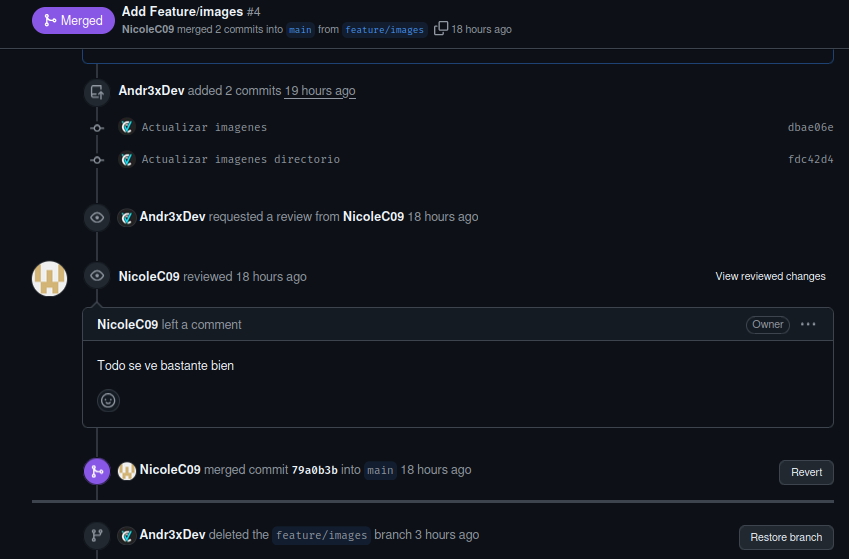

